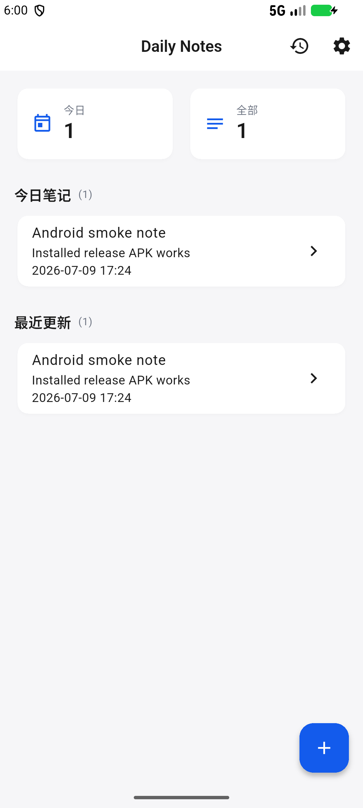

# Daily Notes

[](https://flutter.dev/)
[](https://github.com/chendianshuiyin/daily-notes/releases/tag/v1.0.1)
[](#下载)

Daily Notes 是一个轻量级 Flutter 日常记录应用，当前 MVP 已支持本地笔记创建、编辑、搜索、归档、删除和主题模式持久化。Android release APK 已完成签名、构建、模拟器安装和启动验证。



## 下载

最新版本：[`v1.0.1`](https://github.com/chendianshuiyin/daily-notes/releases/tag/v1.0.1)

- Android: [`daily-notes-v1.0.1-android-release.apk`](https://github.com/chendianshuiyin/daily-notes/releases/download/v1.0.1/daily-notes-v1.0.1-android-release.apk)
- Windows: [`daily-notes-v1.0.1-windows-x64.zip`](https://github.com/chendianshuiyin/daily-notes/releases/download/v1.0.1/daily-notes-v1.0.1-windows-x64.zip)
- Web 静态包: [`daily-notes-v1.0.1-web.zip`](https://github.com/chendianshuiyin/daily-notes/releases/download/v1.0.1/daily-notes-v1.0.1-web.zip)

Android 安装：下载 APK 后在手机上允许“安装未知来源应用”，打开 APK 并按系统提示安装。包名为 `com.chendianshuiyin.dailynotes`。

## 功能

- 新建、编辑、保存和删除笔记。
- 首页展示今日笔记、最近更新和统计卡片。
- 历史页支持搜索、刷新、归档和删除。
- 设置页支持跟随系统、浅色、深色主题，并持久化保存。
- 本地数据使用 `SharedPreferences` 存储，适合 MVP 阶段离线使用。

## 校验信息

| 资产 | SHA-256 |
| --- | --- |
| `daily-notes-v1.0.1-android-release.apk` | `312388469314F86C46B814E1EFCC4F3D32390F2CE9E8678B057E4648C63CEED9` |
| `daily-notes-v1.0.1-windows-x64.zip` | `D9DDC461D75A927BE7C2970B796E61FC8258BF8EFAD4AC7707277D35769BC361` |
| `daily-notes-v1.0.1-web.zip` | `54928E0D0BF971369EE39D317FE65C4794846F2A05DB6306837A55B4E86975D8` |

已通过：

- `flutter analyze`
- `flutter test`，3 个 widget tests
- `flutter build apk --release`
- `flutter build web --release`
- `flutter build windows --release`
- `apksigner verify --print-certs`
- Android emulator install/launch smoke test

## 开发

```powershell
flutter pub get
flutter analyze
flutter test
flutter run -d windows
```

常用发布命令：

```powershell
flutter build apk --release
flutter build web --release
flutter build windows --release
```

创建 GitHub Release：

```powershell
scripts/create_github_release.ps1
```

## 项目结构

- `lib/core`: 主题、常量、工具和通用组件。
- `lib/data`: 数据模型和本地 repository 实现。
- `lib/domain`: repository 接口。
- `lib/presentation`: 页面、路由和 Provider 状态。
- `test`: widget tests。
- `docs`: 计划、进度、截图、发布报告和 Release notes。
- `scripts`: 发布辅助脚本。

## 发布与报告

- 发布说明：[docs/github_release_v1.0.1.md](docs/github_release_v1.0.1.md)
- 发布状态报告：[docs/release_status_report.md](docs/release_status_report.md)
- 最终发布报告：[docs/final_release_report_v1.0.1.md](docs/final_release_report_v1.0.1.md)
- 变更日志：[CHANGELOG.md](CHANGELOG.md)

## 限制与后续计划

- iOS/macOS release 构建需要 macOS 签名环境。
- Linux release 构建需要 Linux 主机/toolchain。
- 真实 Android 手机 USB 安装检查仍建议在实体设备上补做。
- 后续可将笔记存储从 `SharedPreferences` 演进到 SQLite/Isar，并补充同步与导出能力。
