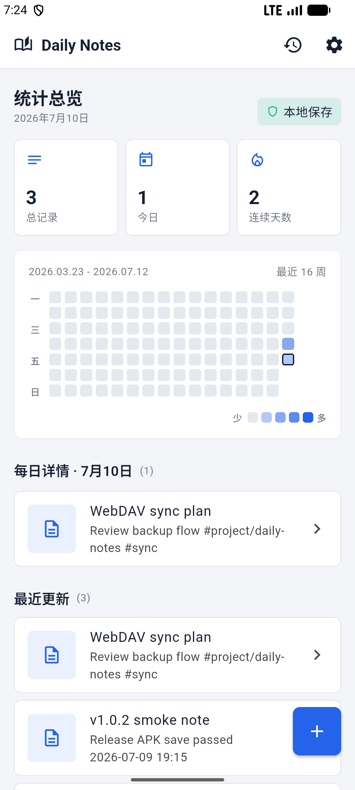
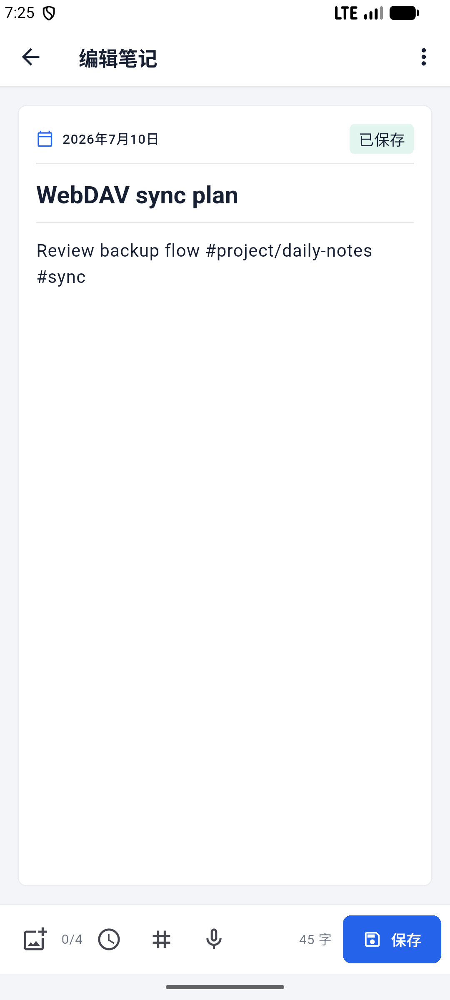
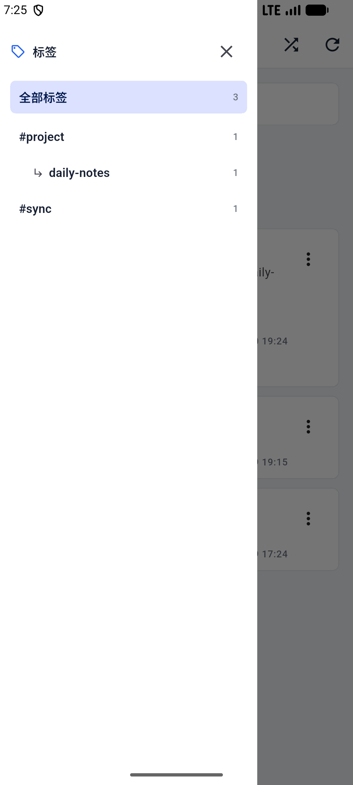
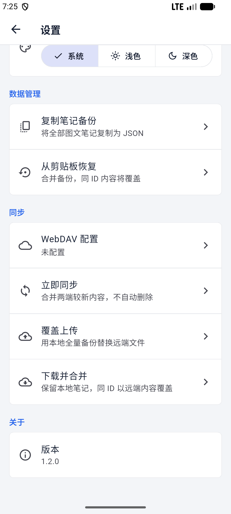

# Daily Notes

[](https://flutter.dev/)
[](https://github.com/chendianshuiyin/daily-notes/releases/tag/v1.2.0)
[](#下载)

Daily Notes 是一个现代、轻量、本地优先的 Flutter 笔记应用。它把文字、图片、语音听写、内联多级标签、写作热力图、JSON 备份和可选 WebDAV 同步整合在同一套低打扰记录流程中。

## 应用预览

| 首页与热力图 | 图文标签编辑器 |
| --- | --- |
|  |  |
| 多级标签侧边栏 | WebDAV 与数据管理 |
|  |  |

## 下载

最新版本：[`v1.2.0`](https://github.com/chendianshuiyin/daily-notes/releases/tag/v1.2.0)

- Android: [`daily-notes-v1.2.0-android-release.apk`](https://github.com/chendianshuiyin/daily-notes/releases/download/v1.2.0/daily-notes-v1.2.0-android-release.apk)
- Windows: [`daily-notes-v1.2.0-windows-x64.zip`](https://github.com/chendianshuiyin/daily-notes/releases/download/v1.2.0/daily-notes-v1.2.0-windows-x64.zip)
- Linux: [`daily-notes-v1.2.0-linux-x64.zip`](https://github.com/chendianshuiyin/daily-notes/releases/download/v1.2.0/daily-notes-v1.2.0-linux-x64.zip)
- Web 静态包: [`daily-notes-v1.2.0-web.zip`](https://github.com/chendianshuiyin/daily-notes/releases/download/v1.2.0/daily-notes-v1.2.0-web.zip)

Android 包名为 `com.chendianshuiyin.dailynotes`。安装 APK 时按系统提示允许当前文件来源即可。

## 核心功能

- 新建、编辑、保存、归档和删除笔记，离开未保存内容前主动确认。
- 在正文中直接输入 `#标签` 或 `#父级/子级`，按标签分支搜索和归档。
- 桌面宽屏显示常驻标签侧边栏，移动端使用滑出侧栏；支持随机回顾当前笔记。
- Android、Web 和 Windows 支持短语音听写，含权限、服务不可用和无语音反馈。
- 每条笔记最多添加 4 张图片，自动缩放压缩，并支持预览与移除。
- GitHub 风格写作热力图，按宽度显示最近 16、28 或 52 周，并查看指定日期记录。
- Hive CE 本地持久化、JSON 复制备份和剪贴板合并恢复。
- 可选 WebDAV 连接测试、双向同步、覆盖上传和下载合并。

## WebDAV 同步

在“设置 > 同步 > WebDAV 配置”中填写服务器地址、用户名、密码或应用密码及远端目录。凭据由平台安全存储保存，默认备份文件为 `/DailyNotes/daily-notes-backup.json`。

“立即同步”会保留两端独有笔记；相同 ID 按 `updatedAt` 选择较新内容，并将合并结果写回远端。删除不会自动传播，避免设备间误删。“覆盖上传”和“下载并合并”用于明确的手动恢复场景。

Web 版必须部署在 HTTPS 或 localhost，并要求 WebDAV 服务端允许站点来源的 CORS 请求。首次使用真实账户前，建议先保留一份 JSON 备份。


## 校验信息

| 资产 | SHA-256 |
| --- | --- |
| `daily-notes-v1.2.0-android-release.apk` | `4927D526136BA9B50C36DC9A3EFDFADBB63863EF6D8F018EA831273C3F53934A` |
| `daily-notes-v1.2.0-web.zip` | `506B80358F17DC9CB5B07A7BB706E207099F1D3D61A32D025D3A69D5FB44BC38` |

Windows 与 Linux 包由 GitHub Actions 从同一标签构建，并随包提供 `.sha256` 文件。发布门禁包括 `flutter analyze`、29 项 unit/widget tests、Android/Web release 构建，以及 Android 36 模拟器升级、保存、冷启动持久化和响应式界面检查。

## 开发

```powershell
flutter pub get
flutter analyze
flutter test
flutter run -d windows
```

Windows 构建需要 Visual Studio 的 C++ ATL 组件。Linux 构建需要 `libsecret-1-dev`，运行时还需要 Secret Service 提供程序。主要目录：`lib/core` 放置主题与通用组件，`lib/data` 包含 Hive repository、模型和同步服务，`lib/domain` 定义 repository 接口，`lib/presentation` 包含页面、路由和 Provider；测试位于 `test/`。

## Android 自动验收

```powershell
pwsh -File scripts/verify_android_device.ps1 -DeviceSerial emulator-5554 -AllowEmulator
```

脚本会核对 APK、升级安装、创建并保存测试笔记，再通过强制停止和冷启动验证持久化。实体手机不属于当前发布门槛。

## 发布资料

- [v1.2.0 发布说明](docs/github_release_v1.2.0.md)
- [发布状态报告](docs/release_status_report.md)
- [变更日志](CHANGELOG.md)

## 当前范围

当前维护 Android、Windows、Linux 与 Web；iOS/macOS 暂不纳入本轮。Linux 版暂不提供语音输入。WebDAV 为用户自行配置的可选同步能力，未配置时应用仍保持纯本地工作。
