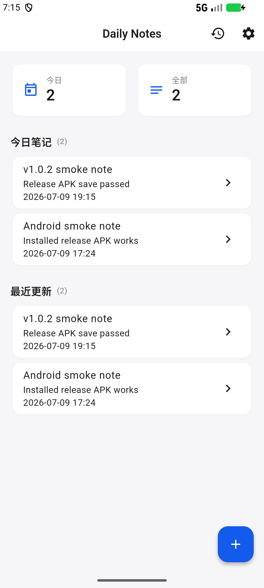

# Daily Notes

[](https://flutter.dev/)
[](https://github.com/chendianshuiyin/daily-notes/releases/tag/v1.0.2)
[](#下载)

Daily Notes 是一个轻量级 Flutter 日常记录应用，当前版本支持本地笔记创建、编辑、搜索、归档、删除、主题持久化和未保存草稿保护。Android release APK 已完成签名、升级安装、创建保存和冷启动持久化验证。



## 下载

最新版本：[`v1.0.2`](https://github.com/chendianshuiyin/daily-notes/releases/tag/v1.0.2)

- Android: [`daily-notes-v1.0.2-android-release.apk`](https://github.com/chendianshuiyin/daily-notes/releases/download/v1.0.2/daily-notes-v1.0.2-android-release.apk)
- Windows: [`daily-notes-v1.0.2-windows-x64.zip`](https://github.com/chendianshuiyin/daily-notes/releases/download/v1.0.2/daily-notes-v1.0.2-windows-x64.zip)
- Linux: [`daily-notes-v1.0.2-linux-x64.zip`](https://github.com/chendianshuiyin/daily-notes/releases/download/v1.0.2/daily-notes-v1.0.2-linux-x64.zip)
- Web 静态包: [`daily-notes-v1.0.2-web.zip`](https://github.com/chendianshuiyin/daily-notes/releases/download/v1.0.2/daily-notes-v1.0.2-web.zip)

Android 安装：下载 APK 后在手机上允许“安装未知来源应用”，打开 APK 并按系统提示安装。包名为 `com.chendianshuiyin.dailynotes`。

## 功能

- 新建、编辑、保存和删除笔记。
- 首页展示今日笔记、最近更新和统计卡片。
- 历史页支持搜索、刷新、归档和删除。
- 设置页支持跟随系统、浅色、深色主题，并持久化保存。
- 编辑器离开前检查未保存修改，保存失败时保留当前草稿并提示重试。
- 本地数据使用 `SharedPreferences` 存储，适合 MVP 阶段离线使用。

## 校验信息

| 资产 | SHA-256 |
| --- | --- |
| `daily-notes-v1.0.2-android-release.apk` | `97098D8C5476F46F2064E98A6137A25DB47FA904171CD2C6E0E61C2D4011F047` |
| `daily-notes-v1.0.2-windows-x64.zip` | `1A29E0BA43F213495568C8B25DD7D3390EF94E77DBE37CB60493E64EBF45E11B` |
| `daily-notes-v1.0.2-linux-x64.zip` | `ED8660A4ABBF29E6EAC3F6974397D0F942DACEA3D5D3F87281DEEA9893AF29C5` |
| `daily-notes-v1.0.2-web.zip` | `92FC877A5C231DC3773B1DAA8BA836E775C2A8AED1A5D2588DE2415247AB0176` |

已通过：

- `flutter analyze`
- `flutter test`，6 个 unit/widget tests
- `flutter build apk --release`
- `flutter build web --release`
- `flutter build windows --release`
- GitHub Actions Linux release build
- `apksigner verify --print-certs`
- Android emulator upgrade/install/save/restart smoke test

## 开发

```powershell
flutter pub get
flutter analyze
flutter test
flutter run -d windows
```

常用发布命令：

```powershell
flutter build apk --release
flutter build web --release
flutter build windows --release
```

创建 GitHub Release：

```powershell
scripts/create_github_release.ps1
```

## 项目结构

- `lib/core`: 主题、常量、工具和通用组件。
- `lib/data`: 数据模型和本地 repository 实现。
- `lib/domain`: repository 接口。
- `lib/presentation`: 页面、路由和 Provider 状态。
- `assets/brand`: 应用图标源文件和可复用品牌资产。
- `test`: widget tests。
- `docs`: 计划、进度、截图、发布报告和 Release notes。
- `scripts`: 发布辅助脚本。

## 发布与报告

- 发布说明：[docs/github_release_v1.0.2.md](docs/github_release_v1.0.2.md)
- 发布状态报告：[docs/release_status_report.md](docs/release_status_report.md)
- 最终发布报告：[docs/final_release_report_v1.0.2.md](docs/final_release_report_v1.0.2.md)
- 变更日志：[CHANGELOG.md](CHANGELOG.md)

## 限制与后续计划

- 当前发布与维护范围为 Android、Windows、Linux 和 Web；iOS/macOS 暂不纳入本轮工作。
- 真实 Android 手机 USB 安装检查仍建议在实体设备上补做。
- 后续可将笔记存储从 `SharedPreferences` 演进到 SQLite/Isar，并补充同步与导出能力。
