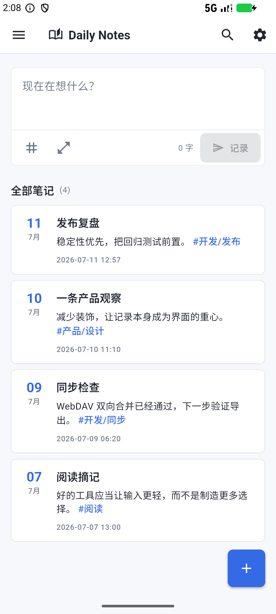
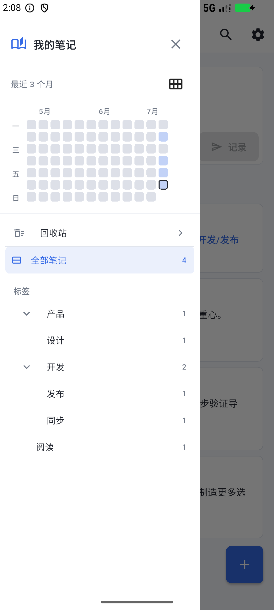
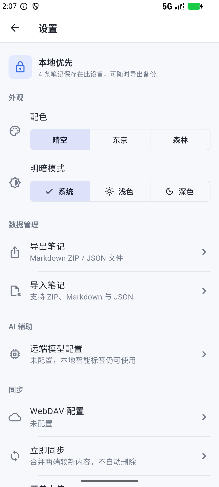
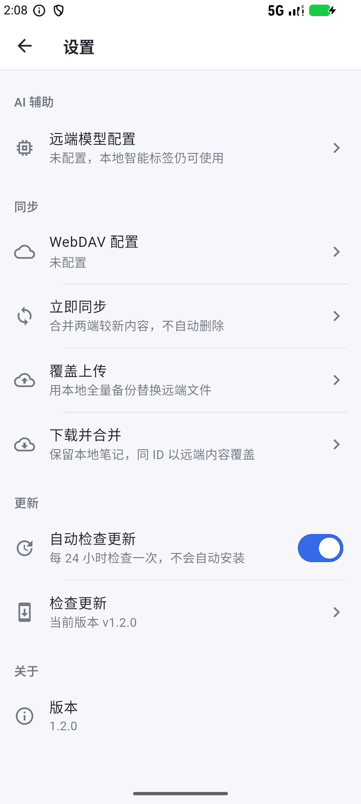
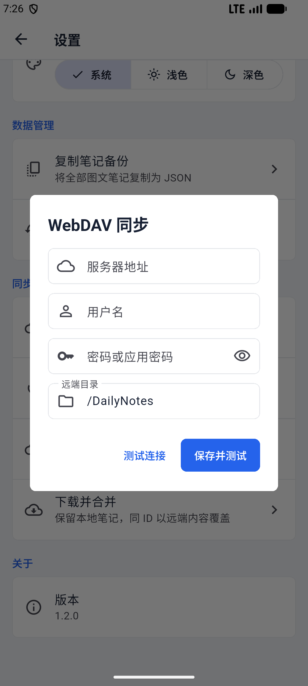

# Daily Notes

[](https://flutter.dev/)
[](https://github.com/chendianshuiyin/daily-notes/releases/tag/v1.2.0)
[](#下载)

Daily Notes 是一个现代、轻量、本地优先的 Flutter 笔记应用。它把文字、图片、语音听写、内联多级标签、写作热力图、文件导入导出和可选 WebDAV 同步整合在同一套低打扰记录流程中。

## 应用预览

| 快速记录与日期笔记流 | 即时搜索 |
| --- | --- |
|  |  |
| 可折叠标签与热力图 | 回收站 |
|  |  |
| 配色与数据管理 | WebDAV 与自动更新 |
|  |  |

## 下载

最新版本：[`v1.2.0`](https://github.com/chendianshuiyin/daily-notes/releases/tag/v1.2.0)

- Android: [`daily-notes-v1.2.0-android-release.apk`](https://github.com/chendianshuiyin/daily-notes/releases/download/v1.2.0/daily-notes-v1.2.0-android-release.apk)
- Windows: [`daily-notes-v1.2.0-windows-x64.zip`](https://github.com/chendianshuiyin/daily-notes/releases/download/v1.2.0/daily-notes-v1.2.0-windows-x64.zip)
- Linux: [`daily-notes-v1.2.0-linux-x64.zip`](https://github.com/chendianshuiyin/daily-notes/releases/download/v1.2.0/daily-notes-v1.2.0-linux-x64.zip)
- Web 静态包: [`daily-notes-v1.2.0-web.zip`](https://github.com/chendianshuiyin/daily-notes/releases/download/v1.2.0/daily-notes-v1.2.0-web.zip)

Android 包名为 `com.chendianshuiyin.dailynotes`。安装 APK 时按系统提示允许当前文件来源即可。

## 核心功能

- 新建、编辑和保存笔记，离开未保存内容前主动确认；删除先进入回收站，可恢复或永久删除。
- 在正文中直接输入 `#标签` 或 `#父级/子级`，按标签分支搜索和整理。
- 首页直接搜索标题、正文与标签；回收站收纳在左侧栏的次级入口。
- 多级标签树支持逐级展开和折叠，移动端从主界面左侧滑出；支持随机回顾当前笔记。
- Android、Web 和 Windows 支持短语音听写，含权限、服务不可用和无语音反馈。
- 每条笔记最多添加 12 张图片，支持图文混排、说明、排序、预览、替换、移除和指定列表封面。
- GitHub 风格写作热力图，默认最近 12 周，月份与星期对齐，并可切换 3 个月、6 个月或 1 年。
- 内置晴空、Tokyo Night 与 Everforest 配色，并可独立切换系统、浅色或深色模式。
- Hive CE 本地持久化；支持 Markdown ZIP 跨应用迁移和 Daily Notes JSON 无损文件备份。
- 可选 WebDAV 连接测试、双向同步、覆盖上传和下载合并。
- 可选 OpenAI-compatible 服务支持标签建议、语音整理、笔记问答和回顾洞察；每次远端发送均先展示并确认范围。
- 默认每 24 小时自动检查 GitHub Release；设置中可关闭或手动检查，发现新版后自动选择当前平台安装包。

## WebDAV 同步

在“设置 > 同步 > WebDAV 配置”中填写服务器地址、用户名、密码或应用密码及远端目录。凭据由平台安全存储保存，默认备份文件为 `/DailyNotes/daily-notes-backup.json`。

“立即同步”会保留两端独有笔记；相同 ID 按 `updatedAt` 选择较新内容，并将合并结果写回远端。删除不会自动传播，避免设备间误删。“覆盖上传”和“下载并合并”用于明确的手动恢复场景。

Web 版必须部署在 HTTPS 或 localhost，并要求 WebDAV 服务端允许站点来源的 CORS 请求。首次使用真实账户前，建议先保留一份 JSON 备份。



## 导入与导出

“设置 > 数据管理”提供两种文件导出：`Markdown ZIP` 将每条笔记写为 UTF-8 Markdown，并把图片放在相对 `media/` 目录，适合迁移到 Obsidian、Joplin、Notion 等工具；`Daily Notes JSON` 保留内容块顺序、图片、时间、回收站状态和标签，适合完整恢复。

导入支持 `.zip`、`.md`、`.markdown` 和 Daily Notes `.json`。导入前会显示笔记与图片数量；同 ID 笔记以导入内容覆盖，其他本地笔记保留。对于大量图文笔记请使用文件导出，不再依赖系统剪贴板容量。

## 校验信息

| 资产 | SHA-256 |
| --- | --- |
| `daily-notes-v1.2.0-android-release.apk` | `4927D526136BA9B50C36DC9A3EFDFADBB63863EF6D8F018EA831273C3F53934A` |
| `daily-notes-v1.2.0-windows-x64.zip` | `18BFF16E2B80C090807FC7851AFBD5025B79719913447EA613B116264E93EBE3` |
| `daily-notes-v1.2.0-linux-x64.zip` | `AEE55F28D3126992C60D94F429C95135B59D41582BB833C05CDE15244EF6861D` |
| `daily-notes-v1.2.0-web.zip` | `506B80358F17DC9CB5B07A7BB706E207099F1D3D61A32D025D3A69D5FB44BC38` |

Windows 与 Linux 包由 GitHub Actions 从同一标签构建，并随包提供 `.sha256` 文件。当前开发门禁包括 `flutter analyze`、80 项 unit/widget tests、受支持平台构建，以及 Android 36 模拟器升级、保存、冷启动持久化和响应式界面检查。

## 自动更新

应用通过 GitHub Releases API 检查公开稳定版本，不发送笔记或设备内容。自动检查默认开启并限制为每 24 小时一次；也可在“设置 > 更新”中关闭或手动触发。发现新版本后，Android 选择 APK，Windows/Linux 选择对应 ZIP，并交给系统浏览器或下载器处理安装；应用不会绕过系统签名与安装确认。

## 开发

```powershell
flutter pub get
flutter analyze
flutter test
flutter run -d windows
```

Windows 构建需要 Visual Studio 的 C++ ATL 组件。Linux 构建需要 `libsecret-1-dev`，运行时还需要 Secret Service 提供程序。主要目录：`lib/core` 放置主题与通用组件，`lib/data` 包含 Hive repository、模型和同步服务，`lib/domain` 定义 repository 接口，`lib/presentation` 包含页面、路由和 Provider；测试位于 `test/`。

## Android 自动验收

```powershell
pwsh -File scripts/verify_android_device.ps1 -DeviceSerial emulator-5554 -AllowEmulator
```

脚本会核对 APK、升级安装、创建并保存测试笔记，再通过强制停止和冷启动验证持久化。实体手机不属于当前发布门槛。

## 发布资料

- [v1.2.0 发布说明](docs/github_release_v1.2.0.md)
- [发布状态报告](docs/release_status_report.md)
- [v1.2.0 最终发布报告](docs/final_release_report_v1.2.0.md)
- [变更日志](CHANGELOG.md)

## 当前范围

当前维护 Android、Windows、Linux 与 Web；iOS/macOS 暂不纳入本轮。Linux 版暂不提供语音输入。WebDAV 与远端 AI 均为用户自行配置的可选能力，未配置时应用仍保持纯本地工作。
