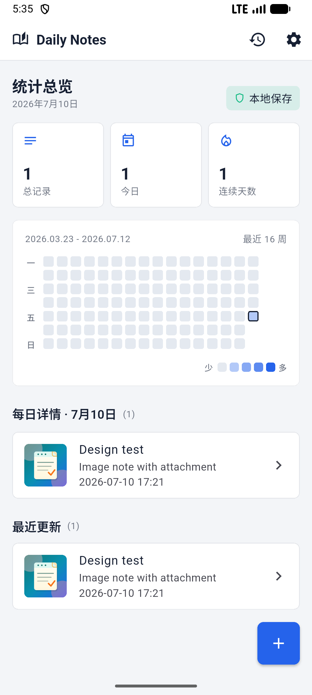
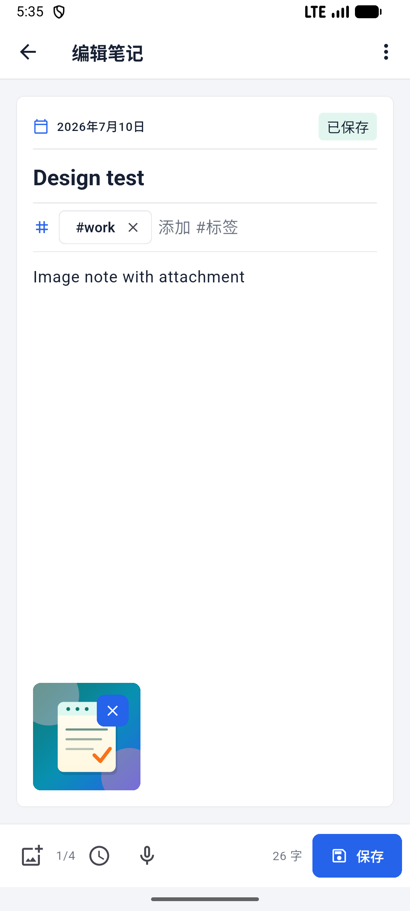
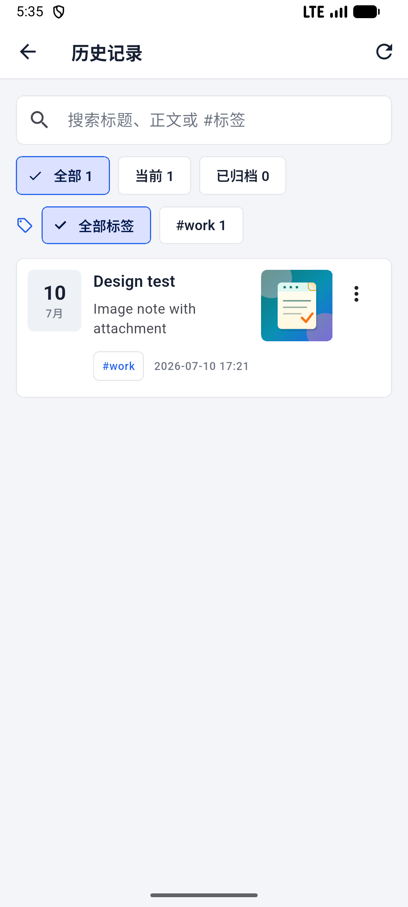
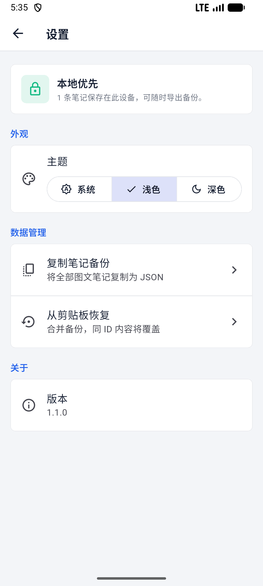

# Daily Notes

[](https://flutter.dev/)
[](https://github.com/chendianshuiyin/daily-notes/releases/tag/v1.1.0)
[](#下载)

Daily Notes 是一个现代、轻量、本地优先的 Flutter 日记应用。它把文字、图片、语音听写、`#标签`、写作热力图和 JSON 备份整合在同一套本地工作流中，适合日常记录、灵感收集和连续写作回顾。

## 应用预览

| 首页与热力图 | 图文编辑器 |
| --- | --- |
|  |  |
| 历史搜索与筛选 | 设置与数据管理 |
|  |  |

## 下载

最新版本：[`v1.1.0`](https://github.com/chendianshuiyin/daily-notes/releases/tag/v1.1.0)

- Android: [`daily-notes-v1.1.0-android-release.apk`](https://github.com/chendianshuiyin/daily-notes/releases/download/v1.1.0/daily-notes-v1.1.0-android-release.apk)
- Windows: [`daily-notes-v1.1.0-windows-x64.zip`](https://github.com/chendianshuiyin/daily-notes/releases/download/v1.1.0/daily-notes-v1.1.0-windows-x64.zip)
- Linux: [`daily-notes-v1.1.0-linux-x64.zip`](https://github.com/chendianshuiyin/daily-notes/releases/download/v1.1.0/daily-notes-v1.1.0-linux-x64.zip)
- Web 静态包: [`daily-notes-v1.1.0-web.zip`](https://github.com/chendianshuiyin/daily-notes/releases/download/v1.1.0/daily-notes-v1.1.0-web.zip)

Android 安装：下载 APK 后允许浏览器或文件管理器“安装未知来源应用”，再按系统提示安装。包名为 `com.chendianshuiyin.dailynotes`。

## Android 自动验收

当前发布使用 Android 36 模拟器作为 Android 端最终验收环境：

```powershell
pwsh -File scripts/verify_android_device.ps1 -DeviceSerial emulator-5554 -AllowEmulator
```

脚本会核对 APK 包名和版本、升级安装、启动应用、创建并保存测试笔记，最后强制停止并冷启动验证持久化。证据输出至 `dist/android-device-verification/`。脚本仍保留默认只接受实体设备的严格模式，但实体手机不是本版发布门槛。

## 核心功能

- 新建、编辑、保存、归档和删除笔记，离开未保存内容前主动确认。
- 为笔记添加最多 8 个 `#标签`，同时识别正文内的 hashtag，并按标签统计、搜索和筛选。
- Android、Web 和 Windows 编辑器支持短语音听写，含录音权限和错误反馈。
- 每条笔记最多添加 4 张图片；选择后自动缩放压缩，支持缩略图、预览和移除。
- GitHub 风格写作热力图，按窗口宽度显示最近 16、28 或 52 周，并查看指定日期记录。
- 历史页搜索标题、正文和 `#标签`，筛选当前或已归档笔记。
- 跟随系统、浅色和深色主题，使用平台字体保证离线首次启动立即渲染。
- 将全部图文笔记复制为 JSON，并从剪贴板合并恢复。
- Hive CE 本地存储；从 v1.0.2 升级时自动迁移旧 `SharedPreferences` 笔记。

## 校验信息

| 资产 | SHA-256 |
| --- | --- |
| `daily-notes-v1.1.0-android-release.apk` | `84B44433730255623F48B85FE7F3BEDB8C2A2DBECBEBDE5C30E7029CE806B5B5` |
| `daily-notes-v1.1.0-windows-x64.zip` | `E778A3441B9948B7990B27D004DD09E859C6353144C3CF2CCB88E06638ACC9D4` |
| `daily-notes-v1.1.0-linux-x64.zip` | `BB3C55A16BD72CDAB8879B396BD6A18ECE742AAB5C7315125416B52A0C80165D` |
| `daily-notes-v1.1.0-web.zip` | `F415C0DDC179F47C41335D5F10AF4C23D62DBC6C369DC3EA5F0220A6AC34115F` |

发布门禁：`flutter analyze` 无问题，23 项 unit/widget tests 通过，Android/Web/Windows release 构建通过；Linux x64 由 GitHub Actions 构建。Android 36 模拟器已验证升级安装、标签保存筛选、录音权限、无语音反馈和旧数据保留。

## 开发

```powershell
flutter pub get
flutter analyze
flutter test
flutter run -d windows
```

主要目录：`lib/core` 放置主题与通用组件，`lib/data` 包含 Hive repository、模型和备份/图片服务，`lib/domain` 定义 repository 接口，`lib/presentation` 包含页面、路由和 Provider；测试位于 `test/`，发布资料位于 `docs/`。

## 发布资料

- [v1.1.0 发布说明](docs/github_release_v1.1.0.md)
- [发布状态报告](docs/release_status_report.md)
- [v1.1.0 最终发布报告](docs/final_release_report_v1.1.0.md)
- [变更日志](CHANGELOG.md)

## 当前范围

当前维护和发布 Android、Windows、Linux 与 Web；iOS/macOS 暂不纳入本轮。Linux 版不提供语音输入，其余笔记功能保持一致。数据默认仅存储在当前设备，不包含云同步。Android 模拟器安装与完整使用流程已通过，实体手机不纳入本版验收范围。
