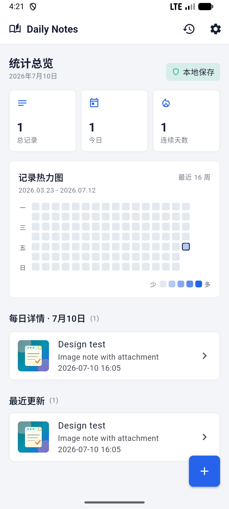
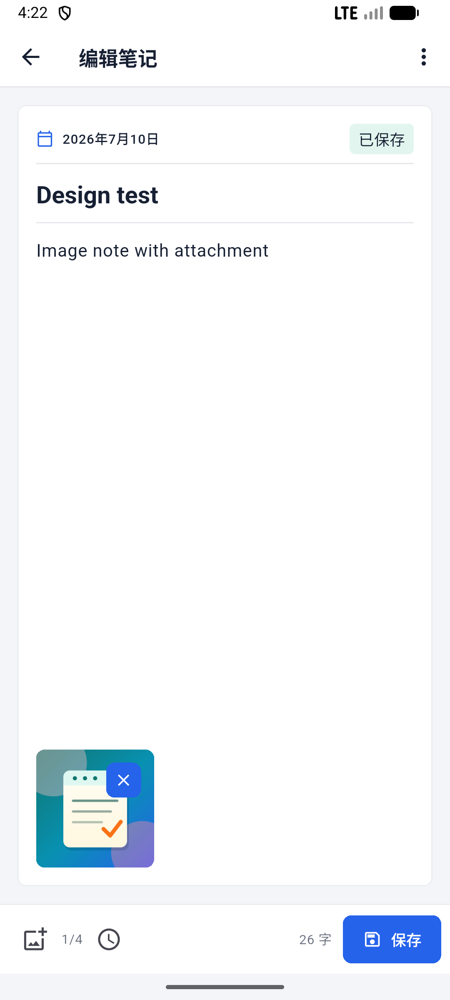
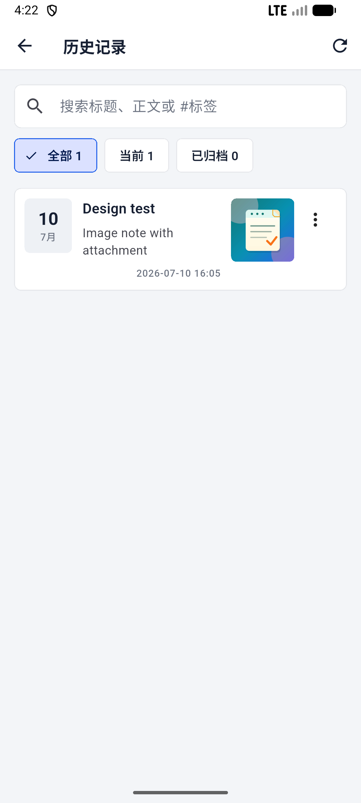

# Daily Notes

[](https://flutter.dev/)
[](https://github.com/chendianshuiyin/daily-notes/releases/tag/v1.0.3)
[](#下载)

Daily Notes 是一个现代、轻量、本地优先的 Flutter 日记应用。它把文字、图片、写作热力图、搜索归档和 JSON 备份整合在同一套离线工作流中，适合日常记录、灵感收集和连续写作回顾。

## 应用预览

| 首页与热力图 | 图文编辑器 |
| --- | --- |
|  |  |
| 历史搜索与筛选 | 设置与数据管理 |
|  |  |

## 下载

最新版本：[`v1.0.3`](https://github.com/chendianshuiyin/daily-notes/releases/tag/v1.0.3)

- Android: [`daily-notes-v1.0.3-android-release.apk`](https://github.com/chendianshuiyin/daily-notes/releases/download/v1.0.3/daily-notes-v1.0.3-android-release.apk)
- Windows: [`daily-notes-v1.0.3-windows-x64.zip`](https://github.com/chendianshuiyin/daily-notes/releases/download/v1.0.3/daily-notes-v1.0.3-windows-x64.zip)
- Linux: [`daily-notes-v1.0.3-linux-x64.zip`](https://github.com/chendianshuiyin/daily-notes/releases/download/v1.0.3/daily-notes-v1.0.3-linux-x64.zip)
- Web 静态包: [`daily-notes-v1.0.3-web.zip`](https://github.com/chendianshuiyin/daily-notes/releases/download/v1.0.3/daily-notes-v1.0.3-web.zip)

Android 安装：下载 APK 后允许浏览器或文件管理器“安装未知来源应用”，再按系统提示安装。包名为 `com.chendianshuiyin.dailynotes`。

## 核心功能

- 新建、编辑、保存、归档和删除笔记，离开未保存内容前主动确认。
- 每条笔记最多添加 4 张图片；选择后自动缩放压缩，支持缩略图、预览和移除。
- GitHub 风格写作热力图，按窗口宽度显示最近 16、28 或 52 周，并查看指定日期记录。
- 历史页搜索标题、正文和 `#标签`，筛选当前或已归档笔记。
- 跟随系统、浅色和深色主题，使用平台字体保证离线首次启动立即渲染。
- 将全部图文笔记复制为 JSON，并从剪贴板合并恢复。
- Hive CE 本地存储；从 v1.0.2 升级时自动迁移旧 `SharedPreferences` 笔记。

## 校验信息

| 资产 | SHA-256 |
| --- | --- |
| `daily-notes-v1.0.3-android-release.apk` | `D38AF67E1C2B325A1542584DB85A11C2C1D709036E24FF938E7209BD4E9E51B9` |
| `daily-notes-v1.0.3-windows-x64.zip` | `EF159C3791382D3FE882046507035164B02609C797BAF97E155818B9199CBC30` |
| `daily-notes-v1.0.3-web.zip` | `49A47E85BF6499EEEDBB053EA23A9C401943881DAFDAFA5CEF1FD5B238F1901D` |

发布门禁：`flutter analyze` 无问题，21 项 unit/widget tests 连续运行通过，Android/Web/Windows release 构建通过；Linux x64 由 GitHub Actions 构建。Android 36 模拟器已验证升级安装、图片选择、保存、冷启动持久化和浅深色界面。

## 开发

```powershell
flutter pub get
flutter analyze
flutter test
flutter run -d windows
```

主要目录：`lib/core` 放置主题与通用组件，`lib/data` 包含 Hive repository、模型和备份/图片服务，`lib/domain` 定义 repository 接口，`lib/presentation` 包含页面、路由和 Provider；测试位于 `test/`，发布资料位于 `docs/`。

## 发布资料

- [v1.0.3 发布说明](docs/github_release_v1.0.3.md)
- [发布状态报告](docs/release_status_report.md)
- [v1.0.3 最终发布报告](docs/final_release_report_v1.0.3.md)
- [变更日志](CHANGELOG.md)

## 当前范围

当前维护和发布 Android、Windows、Linux 与 Web；iOS/macOS 暂不纳入本轮。数据默认仅存储在当前设备，不包含云同步。实体 Android 手机安装仍待连接设备后补充，模拟器安装与完整使用流程已通过。
